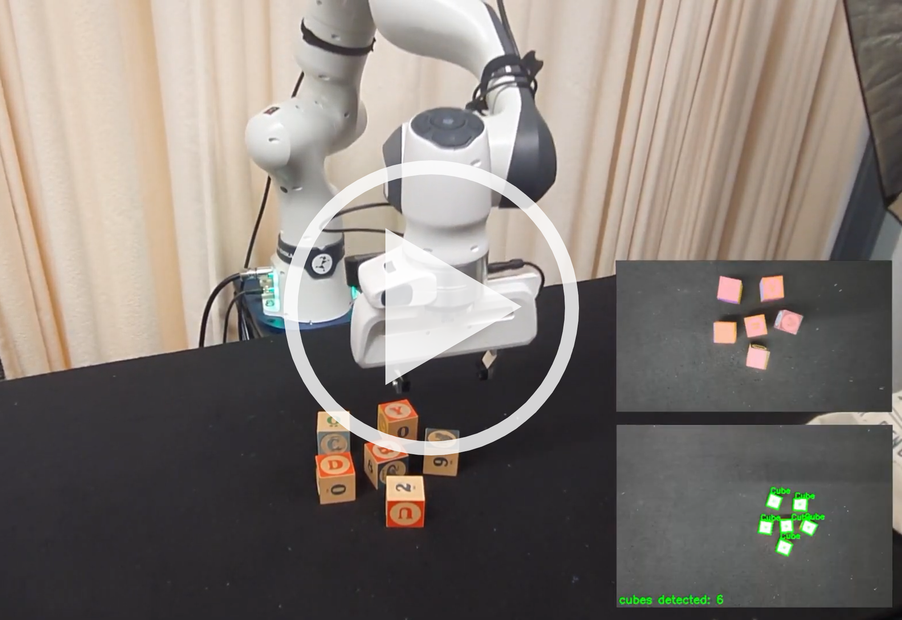

# Intelligent Robotic Manipulation - Project Lab

This repository is a ROS package that was developed during the practical course "Intelligent Robotic Manipulation" from winter semester 2023/24 at TU Darmstadt.

Supervisor: Snehal Jauhri

Team:
- Kaiwen Jin
- Qiuyu Xu
- Caleb Morton
- Emanuel Araujo
- Christian Maurer

## Project

The project is about building a pipeline to control a robotic arm with a camera attached to the end effector. The robot should build a tower out of cubes that are randomly scattered on a table. The general procedure for solving this task, involves multiple components like detection, pose estimation, motion planning and grasping. We developed a state machine to connect the components, control the robotic behavior and track the building process.

<a href="https://www.youtube.com/watch?v=fwjM-2kTqag">
<p align="center">
 
    <br> 
    <em>Demo Video</em>
</p>
</a>


## Getting Started

### Prerequisites

Hardware:
- Panda by [Franka Emika](https://franka.de/)
- ZED2 camera by [Stereolabs](https://www.stereolabs.com)
- Nvidia GPU


Software:
- Ubuntu 20.04
- ROS Noetic
- [ZED SDK](https://www.stereolabs.com/developers/release) (Cuda)

### Installation

Follow the steps to setup a project environment with docker and install all necessary packages:

A docker image that contains the basic packages ([MoveIt!](https://ros-planning.github.io/moveit_tutorials/doc/getting_started/getting_started.html), [libfranka](https://frankaemika.github.io/docs/installation_linux.html), [franka_ros](https://frankaemika.github.io/docs/installation_linux.html), [panda_moveit_config](http://wiki.ros.org/panda_moveit_config) and [franka_zed_gazebo](https://github.com/sophiamoyen/franka_zed_gazebo)) can be pulled with:

```
docker pull docker pull 3liyounes/pearl_robots:franka
```

**_Note:_** More information and an instruction to install docker can be found [here](https://github.com/iROSA-lab/Docker_env).


Inside this environment, install the python API from the ZED SDK:
```
python3 /usr/local/zed/get_python_api.py
```

Add this package to the catkin-workspace:
```
cd /opt/ros_ws
git clone git@github.com:mrchris7/irobman-project.git
```

The code for the pose estimation approach of this project is inside a separate package ([pose_estimation](https://github.com/mrchris7/pose-estimation)) and needs to be added with:
```
git clone git@github.com:mrchris7/pose-estimation.git
```

Install the dependencies for the pose_estimation package:
```
sudo apt-get install libeigen3-dev libglew-dev libglfw3-dev
```


Build the workspace:
```
catkin_make
```

## Code Structure

This ROS package is stuctured as follows:

- ```config/```: general configurations and the definition of towers
- ```images/```: images for documentation
- ```include/```: header files
- ```launch/```: launch files for starting the pipeline
- ```msg/```: message descriptions
- ```objs/```: model files for objects to track
- ```scripts/```: scripts and algorithms (for testing purposes)
- ```src/```: source code including all nodes
- ```srv/```: service descriptions


## Package Usage

### Configuration

The behavior of the robot can be configured before starting the robot pipeline:

- Initial Pose: Change the joint configuration of the robot arm that is used when running the perception, inside ```config/general_config.yaml```.
- Tower Template: Select the template of the tower that should be built, inside ```launch/start_statemachine.launch```. You can also create a new templates inside ```config/```.

### Start the Pipeline
Start the robotic pipeline with all components:
```
roslaunch irobman_project cam2eef_transform.launch robot_ip:=<IP>
roslaunch irobman_project start_components.launch
roslaunch irobman_project start_statemachine.launch
```
Replace ```<IP>``` with the actual robot IP address.


### Motion Planning

This package contains modules that facilitate handling objects with the Franka/Panda arm using Moveit. \
The modules are:
-  MoveGroupControl(eef_control.py): provides interface that allows relative low level control of the arm.
- PickAndPlace (pick_and_place.py): provides interface which allows relative high level control of the arm related to pick and place tasks, such as sending the arm to a desite position, picking an object and droping it in the desire position.
- Gripper (grasping.py): provides interface related to the Panda arm gripper, such as opening it and grasping objects.
- PlanScene (plan_scene.py): provides interface related to the Moveit planning scene, which allows checking for possible colision before making a movement.

Examples usage:
- Setting up the simulation from the Panda arm with Moveit (requires [franka_zed_gazebo](https://github.com/iROSA-lab/franka_zed_gazebo.git) and its dependencies)
```
 roslaunch franka_zed_gazebo gazebo_panda_moveit.launch 
```
- Spawn Cubes:
```
rosrun franka_zed_gazebo spawn_cubes.py
```
- Initiate node to broadcast cubes odometry into parameters:
```
rosrun irobman_project cube_param.py
```
- Initiate pick and place
```
rosrun irobman_project pick_and_place_test.py
```

## Acknowledgment
This project uses the 3D tracking approach [Iterative Corresponding Geometry (ICG)](https://github.com/DLR-RM/3DObjectTracking/tree/master/ICG) by Stoiber et al. 2022